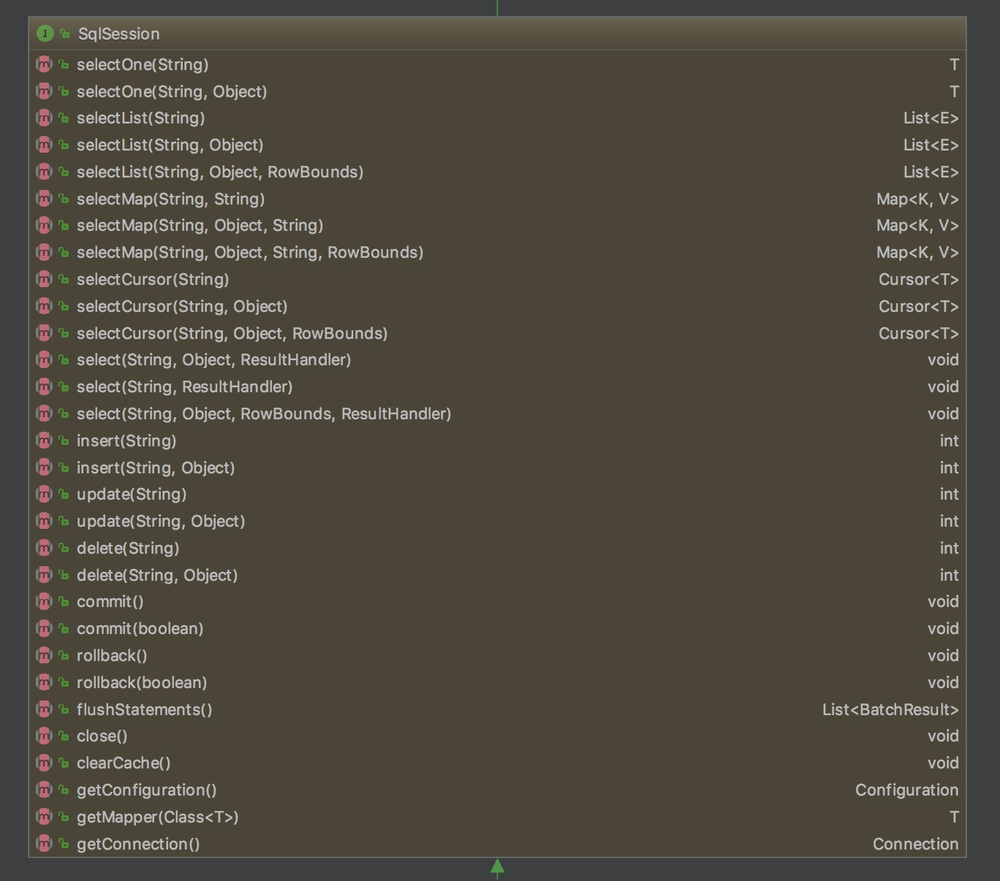
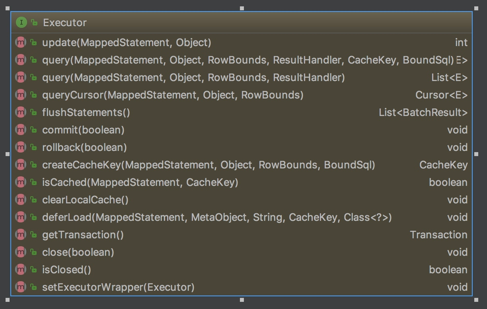
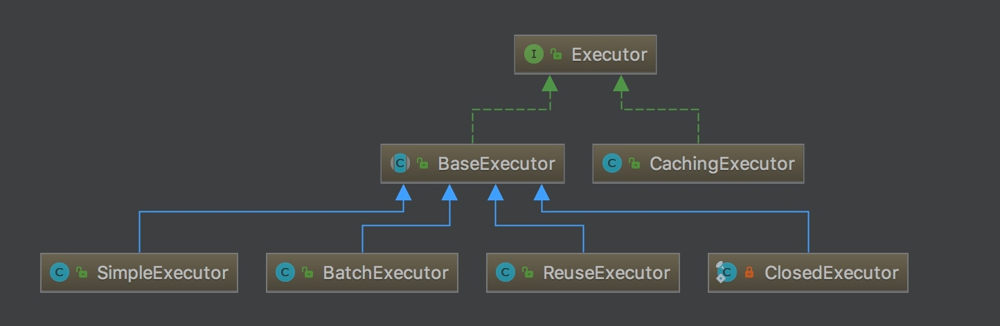

主要内容来源于: https://tech.meituan.com/2018/01/19/mybatis-cache.html

SqlSession： 对外提供了用户和数据库之间交互需要的所有方法，隐藏了底层的细节。默认实现类是DefaultSqlSession。

而具体去做上述这些功能的则是Executor. Executor提供的功能与实现类如下:

所谓的一级缓存就是在BaseExecutor中的一个类型为PerpetualCache的成员变量, 其变量名为localCache. 其内部实质上就是一个HashMap. 