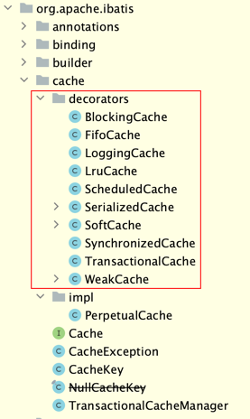
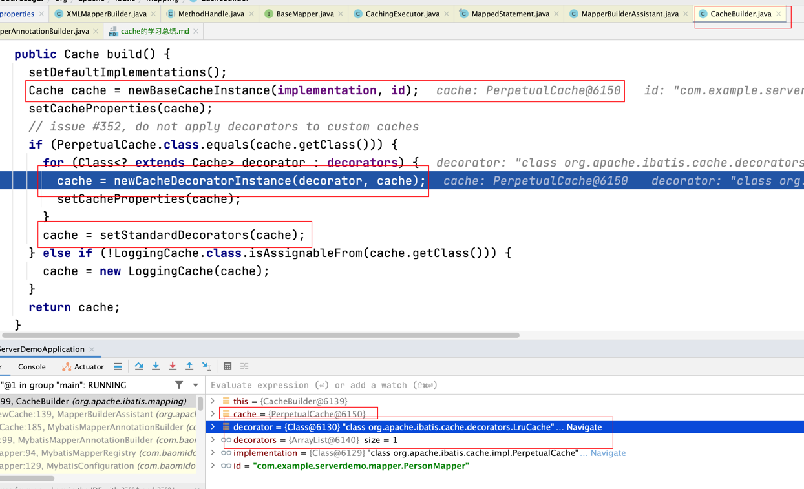
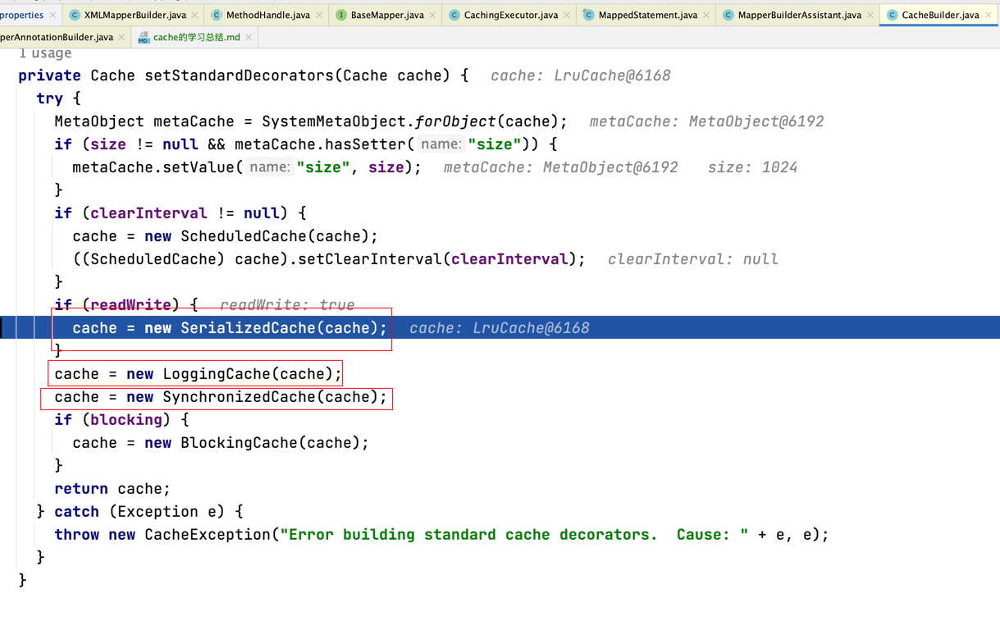
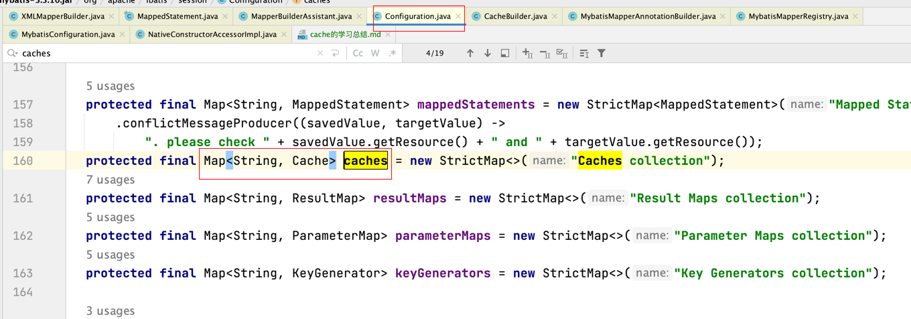
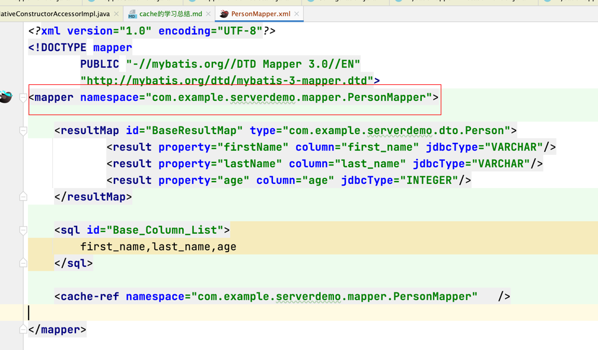
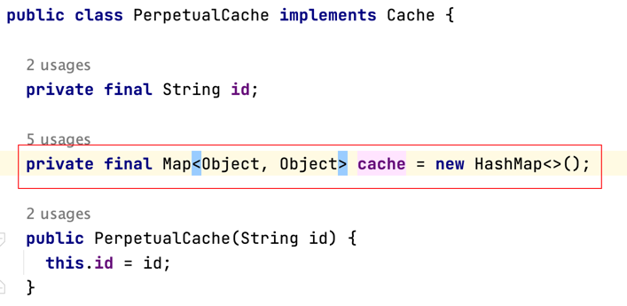
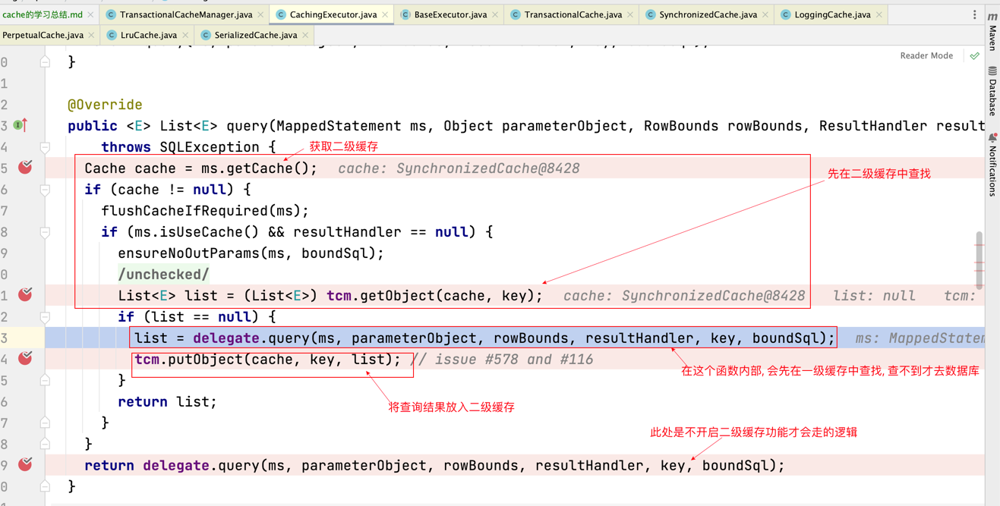
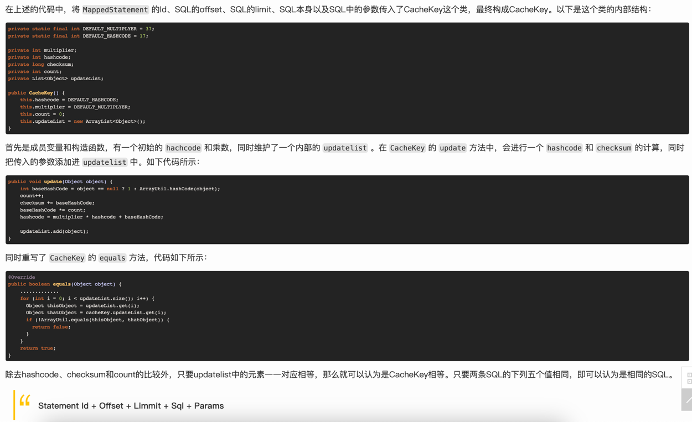

# 前言
Cache接口主要解决的是二级缓存问题. 至于一级缓存只是简单的使用了Cache的一个实现类, 即PerpetualCache, 其内部实质上只是一个HashMap. 一级缓存只在单个SqlSession中有效. 而二级缓存则可以跨SqlSession而存在.

(关于SqlSession: [见SqlSession的学习总结](SqlSession的学习总结.md))

本篇文章主要针对二级缓存展开讲解.

# 核心点
二级缓存在本质上也只是一个PerpetualCache, 这与一级缓存没什么不同. 区别主要在以下两点:
1. 真正的二级缓存是PerpetualCache的增强. 具体的增强方式为装饰器模式. 其装饰类有以下这些: 

    
    
    目前经过我的实验, 在我不加任何指定的情况下, 最终我使用到的Cache的实现类为SynchronizedCache. 其具体的装饰链如下:
    
    
    
    在上图中, 可以看到一开始Cache只是一个PerpetualCache, 但随后经过了decorator后, 被包装为了LruCache, 而随后在经过了setStandardDecorators函数中, 将会依次被包装为SerializedCache, LoggingCache, SynchronizedCache. 
    
    同时注意到, 如果我加入其他指定, Cache还能被继续包装.

2. 二级缓存之所以能够跨SqlSession, 根本原因在于存储二级缓存的地方与存储一级缓存的位置不同.
    
    一级缓存存在于Executor对象中, 而Executor对象则是SqlSession对象的成员变量, 因此一级缓存只能被局限于SqlSession中. 单次业务请求结束后, SqlSession便被销毁. 而后再有请求则会再新开SqlSession对象.
    
    但二级缓存被存在MappedStatement对象中, 而MappedStatement对象又被存放在Configuration对象中. 该对象贯穿始终并被所有SqlSession共享, 从而二级缓存也能跨SqlSession了.

# 其他细节
1. 二级缓存与namespace一一对应, 每个namespace都有自己的二级缓存. 源码:
    
    
    
    此处的key即为namespace. 至于namespace是什么见此处:
    

2. 程序是怎样知道当前执行的语句的结果存在于一级与二级缓存中的?

    答: 根据CacheKey. 该类可以在本文的第一张图片中看到. 而在PerpetualCache中, 存有一个Map.
    
    
    其key为CacheKey, 而value为之前该CacheKey对应的查询结果. 如果该key存在, 那么直接返回之前的查询结果即可, 就不用再去数据库查了. 此套路对于一级与二级缓存相同. 具体在代码中, 会先去查二级缓存, 然后才去查一级缓存, (思考为什么是这个顺序?), 具体流程如下: 
    
    
    
    那么CacheKey具体是什么呢? 此处直接给出网上的解析:
    
    

